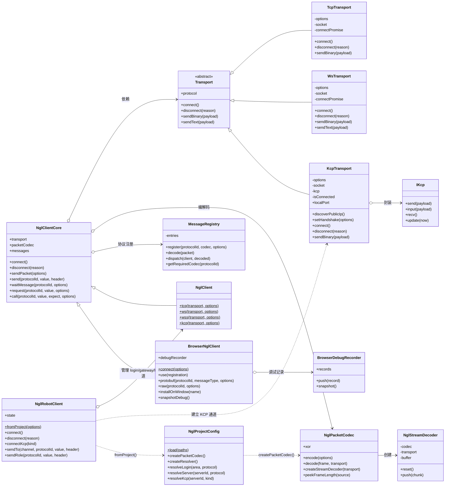
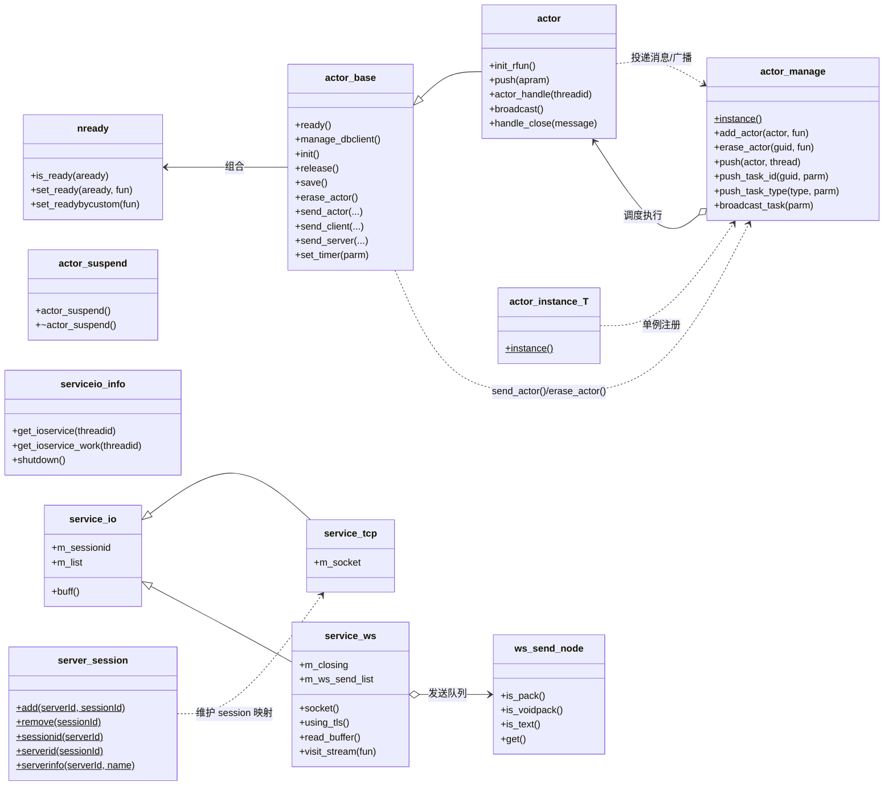

# 项目主干调用类图

本文档聚焦本次补充中文注释时涉及的主干类，不包含以下内容：

- `third_party`、`pb`、`auto`、测试代码
- 纯数据结构或生成协议定义
- 业务层数量很多但关系重复的具体 Actor 子类

类图关系来自当前仓库源码的静态梳理，重点表达继承、组合和主要调用链路。

## 客户端主链路

## 服务端骨架链路

## 阅读建议

- 先看客户端图：`NglClientCore` 是统一入口，`Transport` 是可替换底座，`MessageRegistry` 管协议分发。
- 再看服务端图：`actor_manage` 负责调度，`actor` 负责队列执行，`actor_base` 提供发送、定时器、脚本和 DB 通用能力。
- 如需继续细化业务链路，建议下一步针对 `actor_gateway`、`actor_login`、`actor_role` 单独再拆子图。
